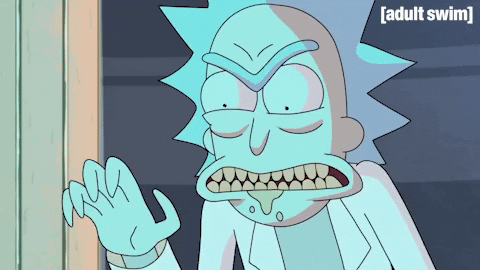

<div align="center">

<picture>
  <source media="(prefers-color-scheme: dark)"  srcset="assets/hero-dark.svg">
  <source media="(prefers-color-scheme: light)" srcset="assets/hero-light.svg">
  
</picture>

<br>

<a href="https://github.com/Glenrunc?tab=followers">
  </a>
<a href="https://github.com/Glenrunc?tab=repositories">
  </a>


</div>

<br>

> *I like the layer underneath.*
> The compiler, not the language. The convolution, not the `import`. The retrieval, not the prompt.
> Most of what is here was written to find out how the thing actually works — and a few of them
> turned into something worth shipping.

<br>

## <samp>$ whoami --verbose</samp>

```console
name        Mattéo  ·  @Glenrunc
role        computer science student, currently majoring in artificial intelligence
path        UTBM (France)  →  AGH Kraków (Poland)  →  UQAC (Québec, Canada)
learned     deep learning & image processing during the Kraków semester — never left
principle   local-first: if it needs an API key to think, it is not mine
building    document intelligence, retrieval pipelines, and neural nets with no imports
```

<table>
<tr>
<td width="33%" valign="top">

**🧭 Working on**

Local, private document
intelligence — OCR, field
extraction and Q&A that never
leaves the machine.

</td>
<td width="33%" valign="top">

**🔬 Learning**

Transformer internals, the
honest way: re-deriving the
attention block instead of
calling it.

</td>
<td width="33%" valign="top">

**🤝 Open to**

AI / ML internships,
research-flavoured work, and
anything involving GPUs and
bad ideas taken seriously.

</td>
</tr>
</table>

<br>

## <samp>$ ls ./featured</samp>

<table>
<tr>

<td width="50%" valign="top">

### 🧠 [Slopformer](https://github.com/Glenrunc/slopformer)

> *“An Image is Worth 16×16 Brainrots”*

A research paper that is a joke and an implementation that is not. A ViT with three real
architectural modifications, a full LaTeX paper, and a test suite that actually passes —
built to understand vision transformers by breaking one on purpose.

`PyTorch` · `LaTeX` · `pytest`


</td>

<td width="50%" valign="top">

### 📄 [DocuFlow AI](https://github.com/Glenrunc/DocuflowAI)

> *Administrative documents, understood offline.*

OCR with **docTR**, extraction and natural-language Q&A with a **local LLM** via Ollama.
A durable job queue serialises the GPU, field schemas live once and are consumed by both
Pydantic and TypeScript, and every bounding box traces back to a real word.

`FastAPI` · `docTR` · `Ollama` · `Postgres` · `React`


</td>

</tr>
<tr>

<td width="50%" valign="top">

### 🔎 [Chatbot UQAC](https://github.com/Glenrunc/Chatbot_UQAC)

> *RAG over a 400-page institutional manual.*

Retrieval-augmented answering on UQAC's management handbook: `bge-m3` embeddings, a
MultiBERT cross-encoder for reranking, `qwen3:8b` for generation — the whole stack running
on a laptop, served through Streamlit.

`RAG` · `Ollama` · `Streamlit` · `reranking`


</td>

<td width="50%" valign="top">

### ⚙️ [CNN from scratch](https://github.com/Glenrunc/CNN_from_scratch)

> *No libraries. No AI assistant. No excuses.*

A convolutional neural network in raw C++ — tensors, convolutions, backpropagation and the
optimiser, all hand-written. The rule taped to the repo: use a library once and the whole
point is gone.

`C++` · `autograd` · `linear algebra`


</td>

</tr>
</table>

<details>
<summary><b>&nbsp;📦&nbsp; The rest of the shelf</b> &nbsp;<sub>(compilers, search, IoT, genetics and one social network)</sub></summary>

<br>

| Project | What it is | Stack |
| :--- | :--- | :--- |
| **[Hack-Compiler-Suite](https://github.com/Glenrunc/Hack-Compiler-Suite)** | Assembler and VM translator for the Hack architecture — the road from symbolic code to machine words, built by hand | `C++` |
| **[Rasende Roboter](https://github.com/Glenrunc/Rasende_Roboter)** | Search algorithms solving the Ricochet Robots board — BFS, heuristics, and a lot of pruning | `Python` |
| **[MI7 · segmentation & deepfake](https://github.com/Glenrunc/MI7_seg_impaint_deepfake)** | Detecting, erasing and re-synthesising humans in video streams | `PyTorch` `Jupyter` |
| **[HUMAN-RECOGNITION](https://github.com/Glenrunc/HUMAN-RECOGNITION)** | Fundamental algorithms for human recognition in images | `Python` `OpenCV` |
| **[ConwayGame](https://github.com/Glenrunc/ConwayGame)** | Conway's Game of Life, in C, because everyone should write it once | `C` |
| **[Genetic algorithm](https://github.com/Glenrunc/Genetic-algorithm-first-approach-)** | A first, deliberate approach to evolutionary optimisation | `C` |
| **[Aquaponics IoT](https://github.com/Glenrunc/Aquaponic-project-IoT-Simulation)** | Simulation of a sensor-driven aquaponics system | `C++` `IoT` |
| **[TheSocialNetwork](https://github.com/Glenrunc/TheSocialNetwork)** | A full social platform, back when PHP and MySQL were the whole world | `PHP` `MySQL` |

</details>

<br>

## <samp>$ cat ./toolbox</samp>

<table>
<tr><td><b>&nbsp;Languages&nbsp;</b></td><td>


</td></tr>
<tr><td><b>&nbsp;AI / ML&nbsp;</b></td><td>


</td></tr>
<tr><td><b>&nbsp;Backend&nbsp;</b></td><td>


</td></tr>
<tr><td><b>&nbsp;Frontend&nbsp;</b></td><td>


</td></tr>
<tr><td><b>&nbsp;Tooling&nbsp;</b></td><td>


</td></tr>
</table>

<br>

## <samp>$ git log --stat</samp>

<div align="center">

<!--
  These two cards are generated by scripts/gen_cards.py and refreshed daily by
  .github/workflows/cards.yml — no third-party service, no broken images.
-->

<picture>
  <source media="(prefers-color-scheme: dark)"  srcset="assets/stats-dark.svg">
  <source media="(prefers-color-scheme: light)" srcset="assets/stats-light.svg">
  
</picture>

<br><br>

<picture>
  <source media="(prefers-color-scheme: dark)"  srcset="assets/heatmap-dark.svg">
  <source media="(prefers-color-scheme: light)" srcset="assets/heatmap-light.svg">
  
</picture>

</div>

<br>

## <samp>$ ping</samp>

<div align="center">

<a href="https://github.com/Glenrunc">
  </a>
<!-- TODO: drop your real LinkedIn URL in here (or delete this badge). -->
<a href="https://www.linkedin.com/in/">
  </a>
<a href="https://github.com/Glenrunc?tab=repositories">
  </a>

</div>

<br>

---

<div align="center">

<sub><i>Built from scratch, on purpose. — <b>@Glenrunc</b></i></sub>

<br><br>

<details>
<summary><sub>⚠️&nbsp; do not open this</sub></summary>
<br>

<br><br>
<sub><i>the only dependency I will never remove.</i></sub>
</details>

</div>
